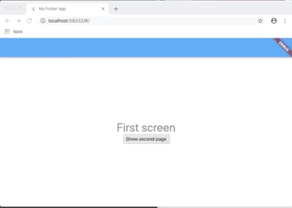
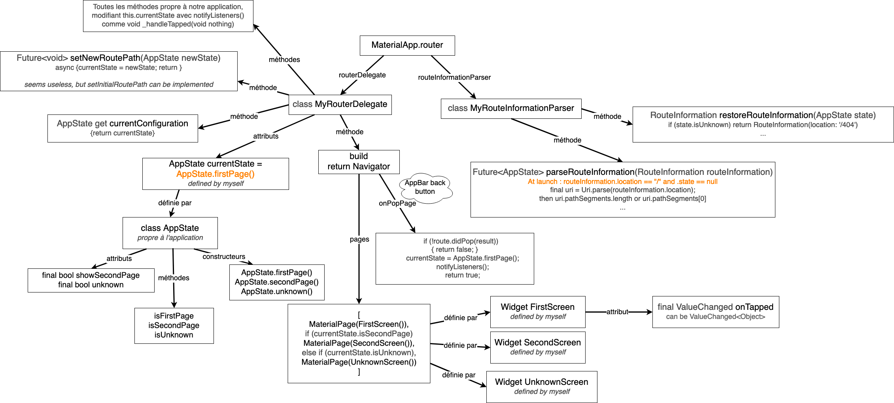
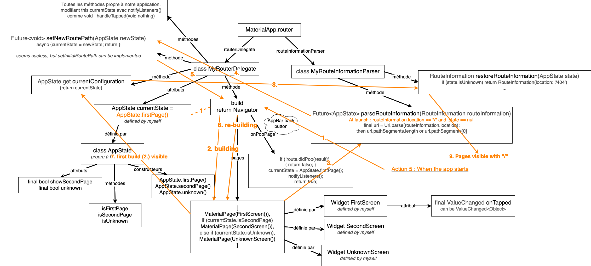

# Flutter Navigator 2.0 simplest implementation

## Flutter Nav functions/files overview

## Action 1 : when pushing a button

## Action 2 : when pushing the NavBar autogenerated button / android back button

## Action 3 : When entering an URL

## Action 4 : when the app lauches

## Action 5 : When using back browser button

## Action 6 : When using forward browser button

## Action 7 : When using refresh browser button

## Challenges 
- Remove the # in the URL
