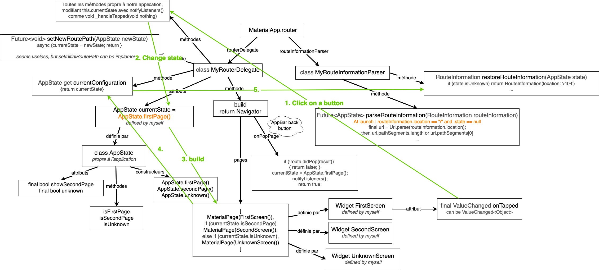

# Flutter Navigator 2.0 simplest implementation

## Flutter Nav functions/files overview

## Action 1 : when pushing a button

## Action 2 : when pushing the NavBar autogenerated button / android back button

## Action 3 : When entering an URL

## Action 4 : when the app lauches

## Action 5 : When using back browser button

## Action 6 : When using forward browser button

## Action 7 : When using refresh browser button

## Understanding Flutter Navigator 2.0

- https://medium.com/flutter/learning-flutters-new-navigation-and-routing-system-7c9068155ade
- https://www.youtube.com/watch?v=wH16ROWAtAk
- https://www.youtube.com/watch?v=FBoAXUkHu44
- https://docs.google.com/document/d/1Q0jx0l4-xymph9O6zLaOY4d_f7YFpNWX_eGbzYxr9wY/edit
- https://github.com/flutter/flutter/issues/45938
- https://github.com/orestesgaolin/navigator_20_example

## Flutter Web to Github Pages

- https://www.youtube.com/watch?v=54SM24tLlhc
## Challenges 
- Remove the # in the URL
